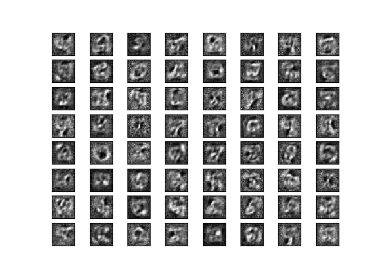
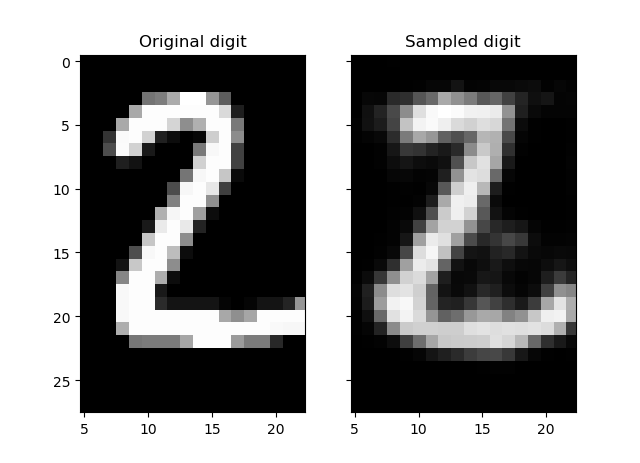

# Restricted Boltzmann Machine (RBM) for MNIST reconstruction

TensorFlow implementation of a Restricted Boltzmann Machine (RBM) for MNIST digits reconstruction.

Check this [video](https://www.youtube.com/watch?v=JKw4z2tKl_4) for some background.

## Requirements
- Python 2.7 or 3.5
- [TensorFlow 1.0.1+](https://www.tensorflow.org/install/)

## RBM Graphical Model

Restricted Boltzmann Machines (RBMs) are a class of undirected probabilistic graphical models containing a layer of observable variables and a single layer of latent variables. In RBMs, there are no connections within a layer. 

The whole system (hidden and visible nodes) is described by an energy function:

- E(v,h) = -v^{T}Wh -v^{T}b - h^{T}c

As in statistical physics,  high-energy configurations are less probable. The joint probability distribution is defined as:

- p(v,h) = e^{-E(v,h)}/Z where Z is the partition function (intractable)

Our goal is to learn the joint probability distribution that maximizes the probability over the data, also known as likelihood.

- p(v) = sum_{h}p(v,h} = e^{-F(v)}/Z where F(v) is called Free Energy

## Inference

The Conditional distribution factorizes (no intra layer connections):

- p(h_{j}=1|v) = p(h_{j}=1, v) / ( p(h_{j}=0, v) + p(h_{j}=1, v) ) = sigmoid(c_{j}+v^{T}W_{:j})

- p(v_{i}=1|h) = sigmoid(b_{i}+W_{i:}h)

## Learning

The parameters of our model are the weights W and the biases b, c. 

### Maximizing the log-Likelihood

Derive log-likelihood and gradient formulas. (TODO)

it is impractical to compute the exact log-likelihood gradient (expectation of the joint distribution).

### Contrastive divergence

Idea:
1. Replace the expectation by a point estimate at v'
2. Obtain the point v' by Gibbs Sampling
3. Start sampling chain at v(t)

1-step divergence:
- Positive divergence: $h(v)v^{T}$
- Negative divergence: $h(v')v'^{T}$ where v' is reconstructed from a sample from h(v)

### Pseudocode:

1. For each training example v(t):

    i. Generate a negative sample v' using k steps of Gibbs Sampling, starting at v(t)
  
    ii. Update parameters
  
        $w_{new} = w_{old} + \epsilon * (h(v(t))v(t)^{T}-h(v')v'^{T}) $
  
        $b_{new} = b_{old} + \epsilon * (h(v(t))-h(v'))$
  
        $c_{new} = c_{old} + \epsilon * (v(t)-v')$
 
2. Go back to 1. until stoppng criteria

The following figure is a representation of the feature detectors. The hidden nodes encode a lower dimensional representation of the data (visible nodes).

## Usage

Run the main.ipynb file in jupyter

## Results

Under progress

## Extensions

Deep Boltzmann Machines and Deep Belief Networks.

Contrastive Divergence k (for k>1 step of MCMC simulation) w/ weight cost or temperature [Tieleman 08]. [video](https://www.youtube.com/watch?v=S0kFFiHzR8M) for Persistent Contrastive Divergence.

...
